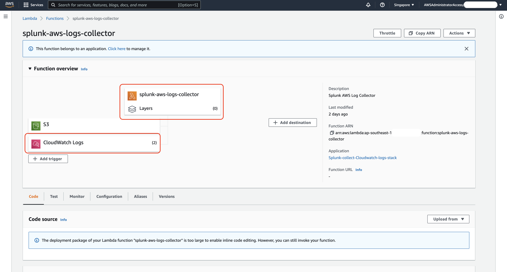
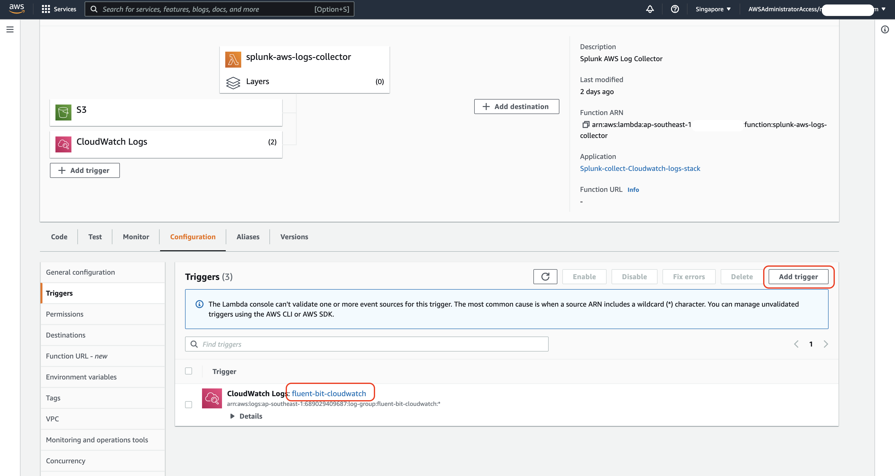

# Overview #


There are 2 methods to export the EKS Fargate clouds into Cloudwatch. 


Both methods have been documented 

### Method 1 ###

[Fluent Bit for Amazon EKS](https://aws.amazon.com/blogs/containers/fluent-bit-for-amazon-eks-on-aws-fargate-is-here/)


### Method 2 ###

[Capture application logs when using Amazon EKS ](https://aws.amazon.com/blogs/containers/how-to-capture-application-logs-when-using-amazon-eks-on-aws-fargate/)


This repository is built on *Method 1* aims to achieve the following objectives

- Explore how to extract logs from EKS Fargate pods to Cloudwatch
- Explore how to export the Cloudwatch logs and import into Splunk Observability Log Observer

Note that this repository has been setup based on the `default` namespace and without deploying the Open Telemetry Helm Chart for simplicity.


---

# Pre-Requisite #

Code has been developed and tested on

```
aws --version
aws-cli/2.3.5 Python/3.8.8 Darwin/21.4.0 exe/x86_64 prompt/off

eksctl version
0.94.0

kubectl version
Client Version: version.Info{Major:"1", Minor:"23", GitVersion:"v1.23.6", GitCommit:"ad3338546da947756e8a88aa6822e9c11e7eac22", GitTreeState:"clean", BuildDate:"2022-04-14T08:41:58Z", GoVersion:"go1.18.1", Compiler:"gc", Platform:"darwin/amd64"}
```

AWS account must be setup with aws configure

---

# Setup and Configurations #


Create the EKS Fargate cluster with Logging enabled.
```
eksctl create cluster -f 1.eks-cluster-config.yaml
2022-04-25 09:39:51 [ℹ] eksctl version 0.94.0
2022-04-25 09:39:51 [ℹ] using region ap-southeast-1
...
...
...
2022-04-25 10:00:27 [✔] EKS cluster "ootb-cluster" in "ap-southeast-1" region is ready
```
```
kubectl get nodes
NAME STATUS ROLES AGE VERSION
fargate-ip-192-168-115-140.ap-southeast-1.compute.internal Ready <none> 3m59s v1.22.6-eks-7d68063
fargate-ip-192-168-153-143.ap-southeast-1.compute.internal Ready <none> 4m v1.22.6-eks-7d68063
```

Next we create the `aws-observability` namespace and the `configmap` required to configure Fluentbit.
```
kubectl apply -f 2.fluentbit-config.yaml
```

Create the IAM policy to allow the role permission to write to Cloudwatch.

```
aws iam create-policy --policy-name eks-fargate-logging-policy --policy-document file://3.permissions.json
```

Attach the IAM policy to the Fargate pods execution role that was created with `eksctl` in step 1. You need to change the `<accountid>` and `<randomId>` accordingly to your environment.

```
aws iam attach-role-policy --policy-arn arn:aws:iam::<accountid>:policy/eks-fargate-logging-policy --role-name eksctl-ootb-cluster-cluste-FargatePodExecutionRole-<randomId>
```

Deploy the sample Nginx application 

```
kubectl apply -f 4.logger-server.yaml && kubectl expose deploy logger-server
```

```
kubectl port-forward svc/logger-server 8080:80 
```

On another terminal, execute 

```
curl localhost:8080
```

```
<!DOCTYPE html>
<html>
<head>
<title>Welcome to nginx!</title>
<style>
html { color-scheme: light dark; }
body { width: 35em; margin: 0 auto;
font-family: Tahoma, Verdana, Arial, sans-serif; }
</style>
</head>
<body>
<h1>Welcome to nginx!</h1>
<p>If you see this page, the nginx web server is successfully installed and
working. Further configuration is required.</p>

<p>For online documentation and support please refer to
<a href="http://nginx.org/">nginx.org</a>.<br/>
Commercial support is available at
<a href="http://nginx.com/">nginx.com</a>.</p>

<p><em>Thank you for using nginx.</em></p>
</body>
</html>
```


We will be able to see the application logs captured inside Cloudwatch under the `fluent-bit-cloudwatch` log groups.


---

# Splunk Observability Configuration #


Inside Splunk Observability enable `Cloudwatch Logs`


Determine which regions the Cloudwatch should be collected. 


Depending how many region/s was/were selected in the previous step, the Lambda function stack msut be deployed separately in each respective region.


Once the stack has been successfully deployed, you will see the Lambda function that will be responsible for pushing the Cloudwatch logs to Splunk Observability.



We need to make one slight modification to Cloudwatch Logs trigger and include the Cloudwatch `fluent-bit-cloudwatch` Log Group




---
# Splunk Observability Log Observer #

Wait for couple of minutes and the logs from Cloudwatch will start to appear.


Attributes of the individual log event.


--- 
# Cleanup


Remove the policy from the role before we use `eksctl` to remove the cluster

```
aws iam detach-role-policy --policy-arn arn:aws:iam::<accountid>:policy/eks-fargate-logging-policy --role-name eksctl-ootb-cluster-cluste-FargatePodExecutionRole-<randomId>
```


Remove the EKS Fargate cluster. Change the region and clustername accordingly if required.

```
eksctl delete  cluster ootb-cluster --region ap-southeast-1
```
